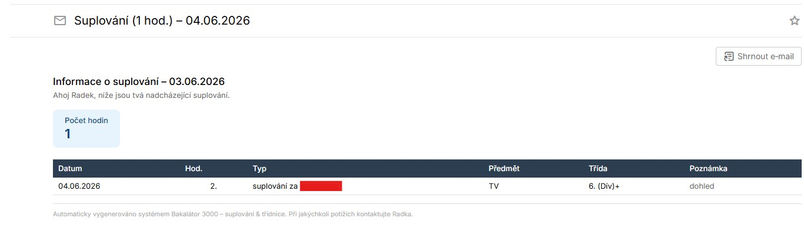
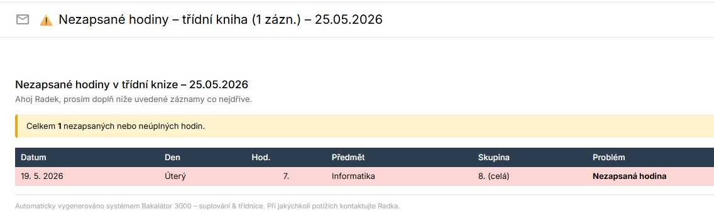
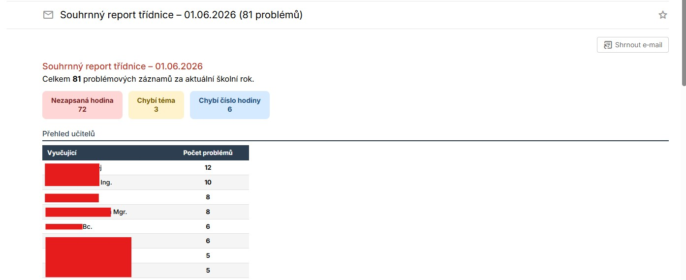
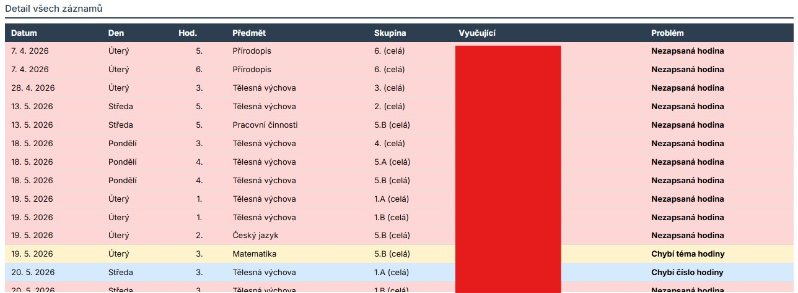
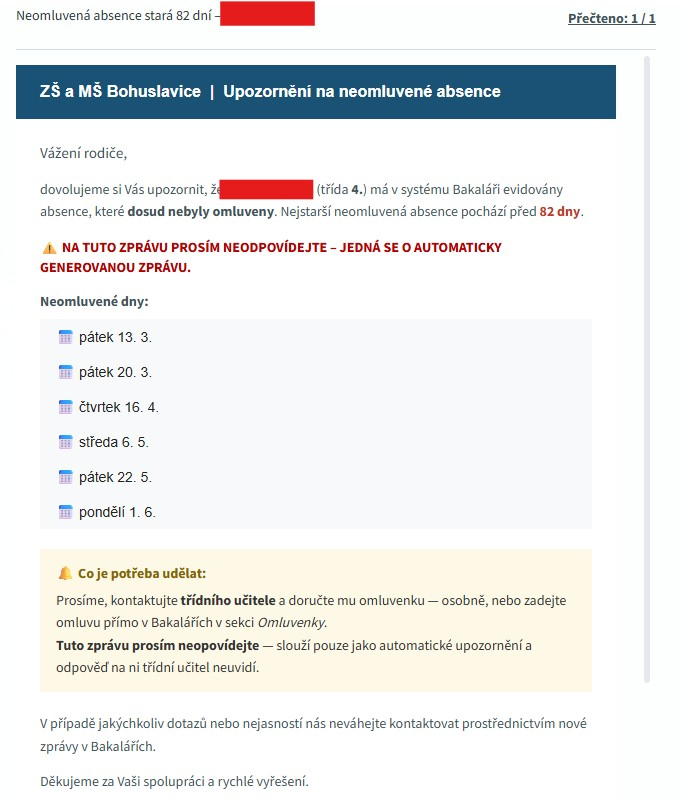

# 🏫 Bakalátor 3000 – Automatizace školní agendy (Bakaláři)

Sada skriptů pro automatické stahování a rozesílání **suplování**, **kontroly třídní knihy** a **upozornění na neomluvené absence** z informačního systému Bakaláři.

> 🧪 Jedná se o open‑source řešení vyvíjené a používané na základní škole.

---

## 🧩 Přehled modulů

| Skript | Účel | Spouštění |
|--------|------|-----------|
| `Supl.py` | Stáhne suplování na dnešek a zítřek, pošle e‑mailem nové změny učitelům. | Každých 15–120 minut (Po–Pá, v neděli) |
| `Tridnice.py` | Zkontroluje třídní knihu – chybějící témata, čísla hodin, nezapsané hodiny; pošle reporty vyučujícím a třídním učitelům. | Každou neděli v 14:00 |
| `Absence.py` | Zkontroluje neomluvené absence, pošle rodičům zprávu přes Komens (vnitřní pošta Bakalářů). | Denně (např. v 5:00) |
| `Absence_mail_tridni.py` | Pošle třídním učitelům měsíční souhrn odeslaných upozornění na absence. | První den v měsíci v 7:00 |

---

## 🧠 Jak to funguje – technický popis

### ✅ Suplování (`Supl.py`)

1. Otevře Chromium v headless režimu, přihlásí se do Bakalářů.
2. Načte stránku suplování na dnešek a zítřek.
3. Parsuje tabulku (BeautifulSoup), extrahuje datum, učitele, hodinu, typ, předmět, třídu, poznámku.
4. Porovná s cache (`cache_suplovani.json`).
5. Nové záznamy odešle e‑mailem dotyčným učitelům (vždy jeden souhrnný e‑mail za učitele).
6. Úspěšně odeslané záznamy uloží do `historie_suplovani.json` (časové razítko odeslání).
7. Aktualizuje cache.

**Zpráva pro učitele**

### ✅ Třídnice (`Tridnice.py`)

1. Přihlásí se do Bakalářů.
2. Otevře stránku kontroly třídní knihy.
3. Pomocí JavaScriptu nastaví parametry kontroly (od začátku školního roku do včerejška, zapne kontrolu čísla hodiny a tématu, vybere všechny třídy).
4. Klikne na **„Provést kontrolu“**.
5. Nastaví zobrazení na 200 záznamů na stránku.
6. Parsuje výslednou tabulku (DevExtreme DataGrid).
7. Rozpozná typy problémů: **Nezapsaná hodina**, **Chybí téma**, **Chybí číslo hodiny**.
8. Odešle e‑maily:
   - **každému vyučujícímu** – seznam jeho problémových hodin,
   - **každé třídní učitelce** – souhrn za její třídu (včetně tabulky vyučujících),
   - **adminovi** – souhrnný report se statistikami.
9. Pokud je první spuštění v měsíci, přidá třídním učitelkám připomínku, aby zapsaly *„Provedena kontrola třídní knihy“*.

**Zpráva pro učitele**


**Zpráva pro správce**


### ✅ Neomluvené absence (`Absence.py`)

1. Přihlásí se do Bakalářů.
2. Přejde na stránku omlouvání.
3. Aktivuje filtr pro zobrazení pouze **nevyřízených absencí**.
4. Pro každého žáka zjistí třídu, jméno a seznam dní absence.
5. Zkontroluje konfiguraci pro danou třídu (`TRIDY_KONFIGURACE` v kódu) – za kolik dní od absence poprvé upozornit a za kolik dní upozornění opakovat.
6. Ověří, jestli už byla zpráva poslána (cache `absence_cache.json`) – pokud ne nebo uplynula frekvence, připraví zprávu.
7. Přes **Komens** (vnitřní pošta Bakalářů) odešle rodičům zprávu – v **HTML** formátu, s jasným upozorněním, že se na ni neodpovídá.
8. Zaznamená odeslání do cache a do `absence_history.json`.
9. Speciální seznam `vyjimky.json` umožňuje vyřadit žáky (např. při dlouhodobé nemoci).

**Zpráva pro rodiče**


### ✅ Měsíční report absencí (`Absence_mail_tridni.py`)

1. Načte `absence_history.json` za posledních 31 dní.
2. Pro každou třídu najde třídního učitele a jeho e‑mail.
3. Pošle přehledný HTML e‑mail – seznam žáků, data odeslání zpráv rodičům a seznam neomluvených dnů.

---

## 🔧 Konfigurační soubory

Všechny konfigurace jsou ve formátu JSON a musí být vytvořeny ručně.

### 📧 `kontakty.json` (seznam všech učitelů a jejich e‑mailů)

```json
[
  { "jmeno": "Nováková Petra", "email": "petra.novakova@skola.example.com" },
  { "jmeno": "Svobodová Jana", "email": "jana.svobodova@skola.example.com" },
  { "jmeno": "Horáková Lucie", "email": "lucie.horakova@skola.example.com" }
]
